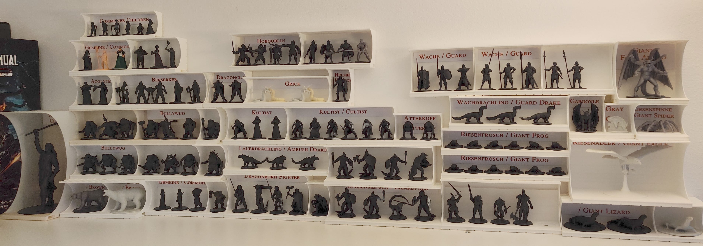
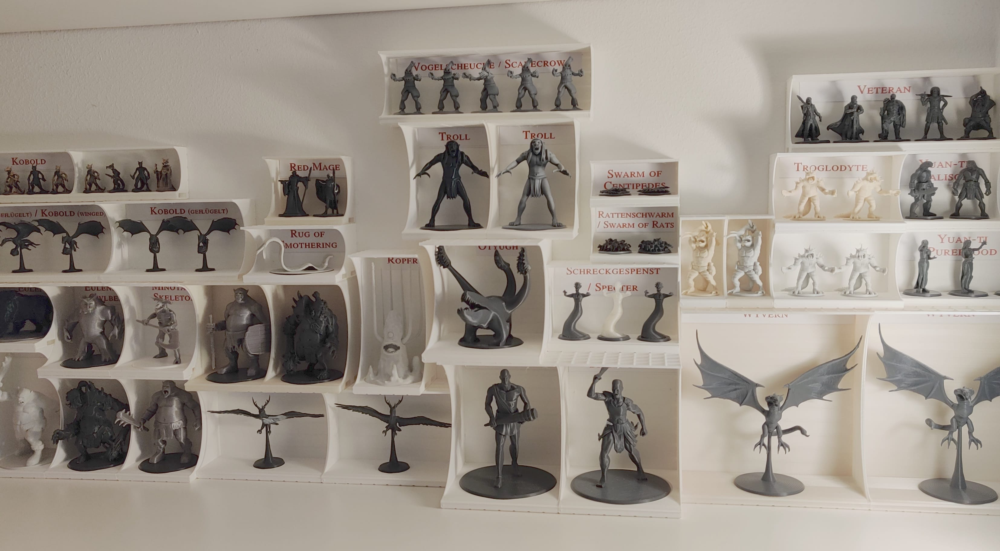
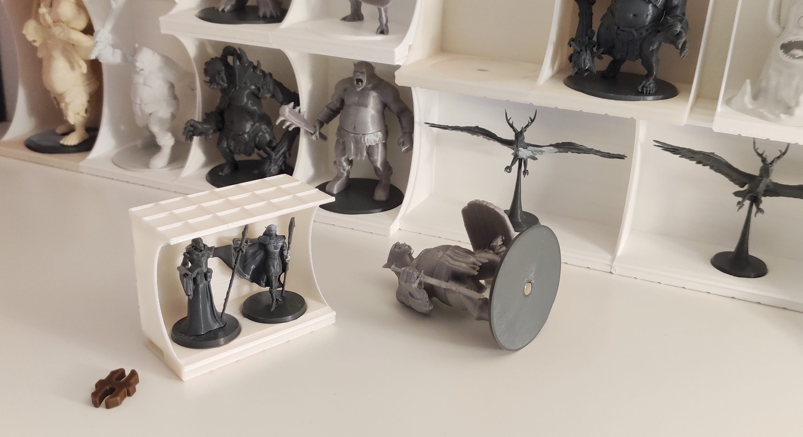
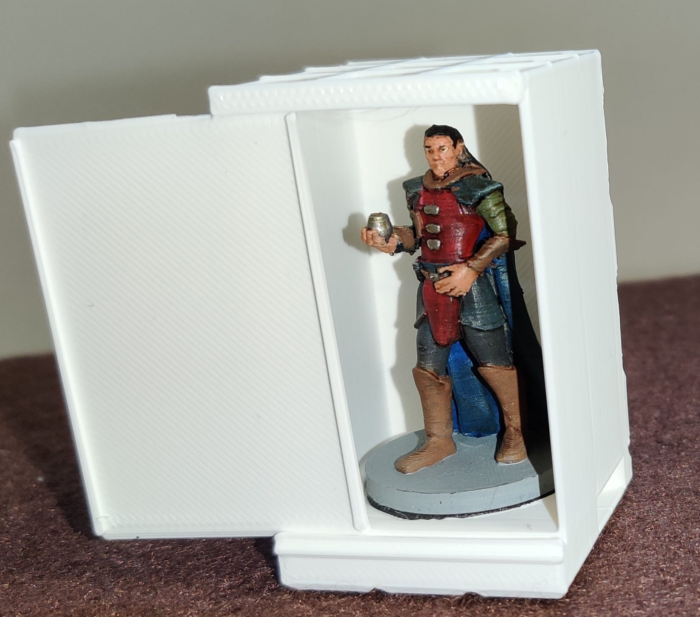
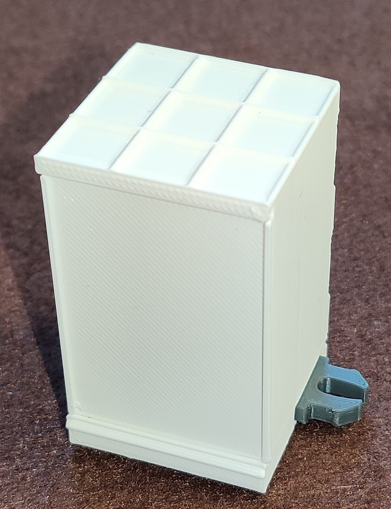
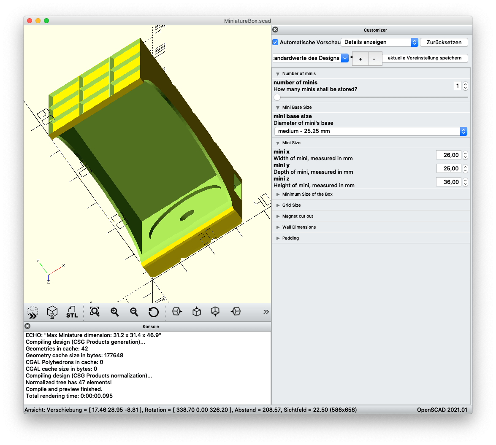

<h1 align="center">MiniBox</h1>

Customizable and modular display and storage boxes for tabletop miniature models

  <a href="#about">About</a> •
  <a href="#download">Download</a> •
  <a href="#customize">Customize</a> •
  <a href="#faqs">FAQs</a> •
  <a href="#credits">Credits</a> •
  <a href="#license">License</a>

## About

Do you need a simple but flexible solution for storing and transporting your 28/32 mm tabletop minitatures?

#### Key features:

- easy and fast to print: box for a standard medium mini is FDM-printed in about 90 minutes
- customizable: use the exact dimensions of your miniatures to model custom sized boxes
- versatile: choose between beautiful boxes with round cut outs or more protective boxes with closable front walls 
- transportable: minis are protected even when they are stacked lying horizontally (when used with [magnetic bases](https://github.com/manolitto/minibase))
- playable: as a GM you can stack minis in front of you without revealing them
- modular: boxes can be stacked and even connected with OpenLOCK clips (which is very convenient when it comes to game play and you want to hold together similar monsters!)
- protective: less dust on your minis when displayed on an open shelf and no dust when using closable boxes
- compatible: ready-made boxes can be used "out of the box" :wink:&nbsp; with my [magnetic mini bases](https://github.com/manolitto/minibase)

  
  

## Customize

1. Download and install OpenSCAD from [here](https://openscad.org/downloads.html).
2. Open [MiniatureBox.scad](./MiniatureBox.scad)
3. Choose box type (open or closable)
3. Enter number of "box passengers", size of the base and the dimensions of your mini model
4. Render and Export STL

## Download

You can find the latest release [here](https://github.com/manolitto/minibox/releases/latest).

## FAQs

**Question:** What size are the magnets for the ready-made boxes?

**Answer:** Axially magnetized cylinder magnets with a diameter of 5 mm (~ 2/10") and thickness of 1 mm (~ 1/32" - 1/24"). I am currently using [these here](https://www.amazon.de/gp/product/B082R64C9N/).

---

**Question:** Not able to get 5x1 mm magnets, I want to use a different size...

**Answer:** Simply adapt the "Magnet cut out" parameter in the SCAD file and create custom boxes.

---

## Credits

The OpenLOCK system was created by [Printablescenery](https://www.printablescenery.com/product/open-lock/).

## License

 MiniBox is licensed under a <a rel="license" href="http://creativecommons.org/licenses/by-sa/4.0/">Creative Commons Attribution-ShareAlike 4.0 International License</a>.
